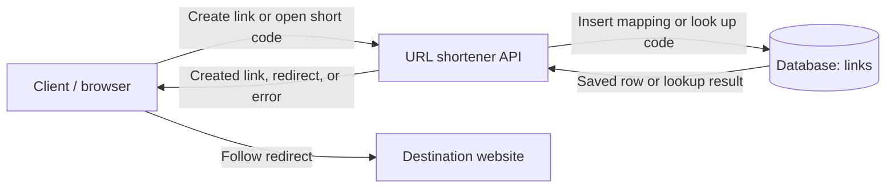
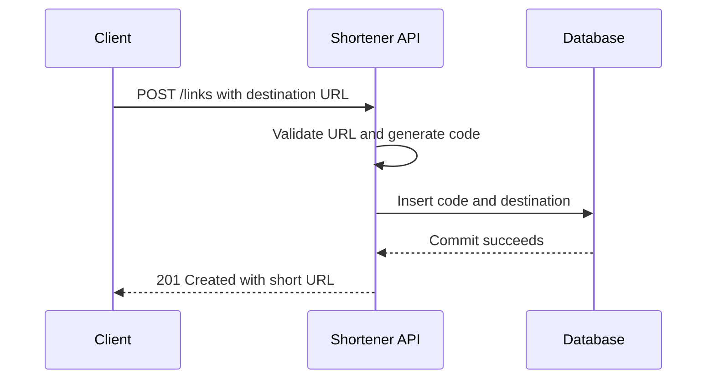
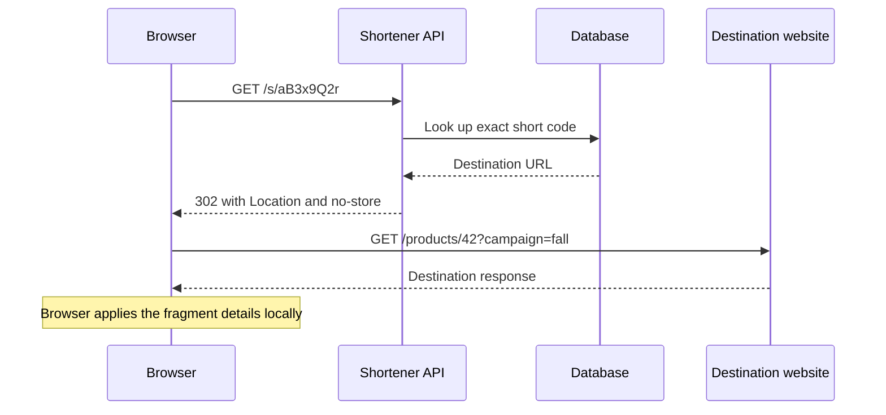

# URL Shortener: A First System Design Exercise

This guide covers the Day 1 system design block in the 60-day plan: define the scope of a URL shortener, choose one latency goal, and draw client → API → database. It explains one possible design, with optional details for later discussion.

- [Your practice worksheet](../SystemDesign/url-shortener/practice.md)
- [Completed reference design](../SystemDesign/url-shortener/reference.md)
- [System design topic guide](../SystemDesign/url-shortener/README.md)
- [Reusable terminology](terminology.md#9-system-design-and-url-shortening)

The documents describe a proposed service. There is no running backend, and the example performance target has not been measured.

## 1. Understand the problem and its purpose

A **URL** is a web address. A shortener gives a long address a short identifier and remembers where that identifier should lead.

```text
Destination: https://shop.example.com/products/42?campaign=fall#details
Short link:  https://go.example.com/s/aB3x9Q2r
Code:        aB3x9Q2r
```

The code does not contain a compressed copy of the entire destination. It identifies a stored mapping:

```text
aB3x9Q2r → https://shop.example.com/products/42?campaign=fall#details
```

When a visitor opens the short link, the service returns a **redirect**: a response asking the browser to request another address. The browser then loads the destination website. This service is useful for links in messages, printed materials, QR codes, and support conversations.

Two Sum used a map from a number to an index. Here the association is a code to a destination URL, and it must remain available across requests and server restarts. An in-memory dictionary is useful for a small prototype; persistent storage is needed for the assumed service behavior. A database lookup has its own storage and network costs, so the Two Sum hash-map complexity claim does not describe the entire service.

## 2. Define the scope before choosing components

A **functional requirement** describes an observable capability. A **non-goal** describes a feature intentionally excluded from this version. A **non-functional requirement** describes a quality such as speed or availability.

Start by asking the interviewer about link lifetime, whether links can change, and expected traffic. If answers are unavailable, label your choices as assumptions. This example assumes one region, modest traffic, no expiration or destination edits, and accepts multiple codes for the same long URL.

### Three functional requirements

| Requirement | A concrete success or failure example |
| --- | --- |
| Create a stored short link for a valid absolute HTTP(S) URL. | Submitting the destination above returns a usable short link after its mapping is saved. |
| Redirect visitors who open a known short link. | Opening `/s/aB3x9Q2r` directs the browser to the complete stored destination. |
| Provide clear input and lookup failures. | Bad input is rejected; an unknown code is distinguished from a database failure. |

### Two non-goals

1. **User accounts and ownership management:** this exercise can focus on link creation and redirection.
2. **Click analytics and reporting:** the first version needs no event collection or reporting flow.

These are choices for this exercise. Another interview can reasonably have a different scope.

## 3. Choose a goal that can be measured

“It should be fast” leaves too much unstated. Define the operation, timing boundary, percentile, workload, and observation period.

**Example target:** p95 successful redirect processing time ≤ 100 ms, from receipt at the API to completion of its redirect response, during a 10-minute test at 100 valid-link redirects per second with 100,000 stored mappings. Count failed requests and timeouts separately. This is an assumed target, not evidence that the design achieves it.

**Latency** is elapsed time for an operation. **p95** is the 95th percentile: roughly 95% of observations are at or below that duration. For a simple nearest-rank calculation with 20 sorted observations, take the 19th value. If that value is 80 ms and the slowest is 450 ms, p95 is 80 ms; the slowest observation still matters.

The timing here covers the shortener's work. It excludes the user's network and the destination website's load time, which this service cannot fully control. A percentile over successful responses can hide failed requests, which is why failure counts must be reported alongside it. Availability is a separate quality to discuss in later exercises.

## 4. Decide what the system must remember

Work backward from the behavior: given a code, the service needs the original destination. Store one row per generated link.

| Field | Example | Reason |
| --- | --- | --- |
| `short_code` | `aB3x9Q2r` | Identifies one mapping; must be unique and is case-sensitive. |
| `destination_url` | `https://shop.example.com/products/42?campaign=fall#details` | Contains the complete address for the browser. |
| `created_at` | `2026-09-29T18:00:00Z` | Records when the mapping was created. |

A **database** stores data for later retrieval. A **primary key** identifies a row uniquely. PostgreSQL enforces a primary key's uniqueness and creates an index for it; an **index** helps locate matching rows efficiently. See the [PostgreSQL constraint documentation](https://www.postgresql.org/docs/current/ddl-constraints.html#DDL-CONSTRAINTS-PRIMARY-KEYS).

For this example, choose a persistent relational database such as PostgreSQL. The choice gives the initial design durable mappings and database-enforced code uniqueness. Detailed database comparison and deployment are later exercises.

Choose randomly generated eight-character codes from letters and digits, for example `aB3x9Q2r`. Randomness does not guarantee uniqueness. Let the database reject a duplicate code, then try another candidate, with at most three insert attempts. Never overwrite a mapping because two generated codes match. Database enforcement is important because requests can overlap; an application check followed by an insert can race.

The original query string (`?campaign=fall`) and fragment (`#details`) are preserved in the stored destination and redirect. Arbitrary changes to them could change what the link does. In HTTP navigation, the browser uses the fragment locally rather than sending it to the destination server. See [HTTP Semantics: determining the target resource](https://www.rfc-editor.org/rfc/rfc9110.html#section-7.1).

## 5. Draw the components and give each a job

A **client** sends requests; here it is a browser or a small form. The **API** is the service interface that accepts creation requests and handles short-link visits. The database remembers the mappings. The destination website is separate.



The API validates input, chooses a code, saves or retrieves the mapping, and returns a response. It returns an address for the browser to follow; loading the target website is the browser's responsibility.

### Creating a link

An **endpoint** combines an address with an operation. `POST /links` means submit a creation request to `/links`. **JSON** is the text format used for the example request and response body.

```http
POST /links HTTP/1.1
Host: go.example.com
Content-Type: application/json

{"url":"https://shop.example.com/products/42?campaign=fall#details"}
```

1. Validate that the destination is an absolute HTTP(S) URL with a host. For this version, reject embedded credentials, control characters, and the shortener's own host. Choose a maximum of 2,048 UTF-8 bytes as an explicit input policy; it is not a universal URL limit.
2. Generate a candidate code.
3. Insert the mapping. A duplicate-code rejection gets another candidate within the three-attempt limit.
4. Wait for the database to **commit**, meaning it completes the write under its configured durability guarantees.
5. Return the short URL. Returning success before the mapping is saved could give the user an unusable link.



The diagram shows the success path. For invalid input return `400`; for a database failure or exhausted code attempts return `503`.

```http
HTTP/1.1 201 Created
Content-Type: application/json
Location: https://go.example.com/s/aB3x9Q2r

{"shortUrl":"https://go.example.com/s/aB3x9Q2r"}
```

`201 Created` reports successful creation, and its `Location` identifies the created resource. See [HTTP Semantics: 201](https://www.rfc-editor.org/rfc/rfc9110.html#name-201-created).

### Opening the short link

```http
GET /s/aB3x9Q2r HTTP/1.1
Host: go.example.com
```

1. Extract the exact code from the path.
2. Look up its row in the database.
3. If the query succeeds but finds no row, return `404`.
4. If the query fails because storage is unavailable, return `503`.
5. If the row exists, return a redirect to its stored destination.
6. The browser requests that destination.

```http
HTTP/1.1 302 Found
Location: https://shop.example.com/products/42?campaign=fall#details
Cache-Control: no-store
```

`302 Found` directs a browser to the address in `Location`. A `302` does not declare that the original address has permanently moved. `Cache-Control: no-store` tells caches not to store this response; a `302` alone does not prohibit caching. See [MDN: 302](https://developer.mozilla.org/en-US/docs/Web/HTTP/Reference/Status/302), [Location](https://developer.mozilla.org/en-US/docs/Web/HTTP/Reference/Headers/Location), and [Cache-Control](https://developer.mozilla.org/en-US/docs/Web/HTTP/Reference/Headers/Cache-Control#no-store).



The API's redirect can succeed even if the destination later fails. Those are two different operations.

## 6. Trace failures and explain trade-offs

| Situation | Example behavior in this design | Reason |
| --- | --- | --- |
| Invalid input or unsupported URL scheme | `400 Bad Request`; no mapping created. | The request violates the agreed input contract. |
| Unknown code | `404 Not Found` after a successful lookup returns no row. | The requested mapping does not exist. |
| Duplicate generated code | Retry another candidate; keep the old mapping. | One code must identify one destination. |
| Database unavailable | `503 Service Unavailable`. | A failed lookup cannot establish whether a code exists. |
| Same destination submitted twice | May produce different codes. | Destination deduplication is not promised. |
| API restarts | Saved mappings remain in the database. | Data is stored outside the API process. |
| Destination page is removed | Browser may get an error from that website after following the redirect. | URL syntax validation does not guarantee future reachability. |
| Creation response is lost after commit | A link may exist despite the client's timeout. | Saving a link and delivering its response are separate events; retry may create an additional link. |

The general meanings of the error status codes are defined in [HTTP Semantics](https://www.rfc-editor.org/rfc/rfc9110.html#name-status-codes).

| Choice | Benefit | Cost or limitation |
| --- | --- | --- |
| Persistent database with a unique code key | Mappings survive API restarts, and concurrent inserts cannot overwrite an existing code. | Storage and network operations add cost and an availability dependency. |
| One API service and one database in the initial diagram | Small enough to explain and inspect. | The diagram alone establishes no recovery or redundancy if either component fails. |
| `302` plus `no-store` | Each visit can consult the service's current behavior; future policies remain possible. | Each visit adds a service request and database lookup. |
| Random codes with bounded collision handling | Code creation has no central sequential-number allocation step. | Candidate collisions must still be handled. |

A **cache** stores copies for faster reuse. Add one only after stating a need and deciding how stale data and updates would behave. The Day 1 task is to explain a coherent initial design. Traffic estimates, database modeling, cache policies, and availability are follow-up sessions.

## 7. Hypothetical industry scenario

A support team shares long help-article links in chat messages. Its messaging tool submits an article URL to the shortener and displays the returned short link. Customers click that link and reach the help center.

Under this exercise's scope, the shortener stores the mapping and redirects visitors. The team has explicitly deferred accounts and click reports. If storage fails during creation, the tool receives a service error rather than claiming it created a usable link. If the help center later removes an article, the customer's destination request can fail even when the mapping still works.

The scenario illustrates two useful boundaries: an API needs a committed mapping before acknowledging creation, and a shortener cannot promise that a separate website will always be available. A public launch would also need a defined abuse-handling policy; accepting syntactically valid URLs alone does not establish destination safety. Those decisions would change the requirements.

## 8. A 25-minute practice method

| Time | Work | Evidence |
| --- | --- | --- |
| 5 minutes | Restate the problem and recall the terms. | One example and your assumptions. |
| 15 minutes | Write three requirements, two non-goals, and one latency goal; draw and trace the flows. | Filled worksheet and diagram. |
| 5 minutes | Explain one failure path and one trade-off aloud. | A 60–90 second explanation and one gap to revisit. |

Try the [practice worksheet](../SystemDesign/url-shortener/practice.md) using your own assumptions. Compare with the [reference](../SystemDesign/url-shortener/reference.md), then explain why any differences are reasonable. Mark whether you used a hint or the guide; seeing the answer does not establish independent ability to design a new variation.

## 9. Interview follow-ups with answers

**Why is a dictionary in the API process insufficient for this version?**

The mappings must survive an API restart and remain available to later requests. A process-local dictionary loses them when that process ends. Durable storage provides the persistence required by this scope.

**Why return success after the write commits?**

The returned code needs an existing mapping. If the service responds first and its write fails, it has reported a created link that is not usable.

**Can random codes collide?**

Yes. The database must enforce uniqueness, and creation must retry a different code within a bounded number of attempts. An application-only pre-check is insufficient with overlapping requests.

**Why distinguish 404 from 503?**

A 404 follows a successful query that found no mapping. A 503 indicates that the service could not perform its work, so it cannot conclude that the mapping is absent.

**Why use 302 instead of 301?**

This example avoids declaring the mapping permanent. A 301 declares a permanent move and can encourage later navigation directly to the destination. The separate `no-store` policy controls response storage in this design. Another scope could intentionally choose permanent redirects. See [HTTP Semantics: 301 and 302](https://www.rfc-editor.org/rfc/rfc9110.html#name-301-moved-permanently).

**Does p95 ≤ 100 ms mean every request is within 100 ms?**

No. Some requests can take longer. Examine slower percentiles, timeouts, and failure rates too. The boundary and workload also matter when interpreting the result.

**What happens if the client retries after a creation timeout?**

The first request may already have committed. The current scope permits multiple codes for a destination, so a retry may create another one. If the product requires one creation per logical request, introduce an idempotency rule: repeated requests identified as the same operation must reuse its result.

**When would you add a cache or more API instances?**

Use the required workload, measured bottlenecks, and availability expectations to justify a change. A cache needs freshness and failure policies; additional API instances need shared storage and routing. A bigger diagram alone does not prove the service meets its goals.

## 10. Mistakes to catch

- “Fast” without an operation, percentile, timing boundary, or workload.
- Treating a proposed latency target as an achieved benchmark.
- Returning a link before its mapping is stored.
- Treating a failed lookup as proof that a code does not exist.
- Claiming randomly generated or truncated hashed codes cannot collide.
- Drawing only one-way arrows and leaving returned information unexplained.
- Forgetting that the browser follows the redirect to a separate website.
- Copying additional components without explaining which requirement they meet.

Read [the glossary](terminology.md#9-system-design-and-url-shortening) for the terms used here. To practice locally, open the Markdown worksheet; GitHub renders its Mermaid blocks when you push the design for review.
