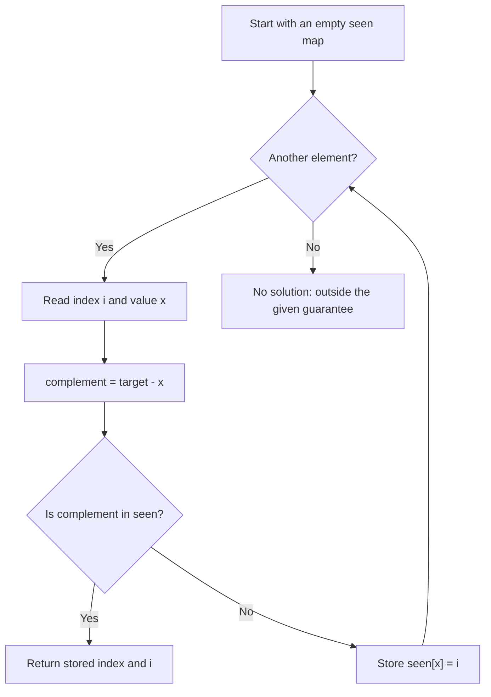
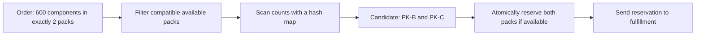

# Two Sum

## 1. What the problem asks

Given an integer array `nums` and an integer `target`, find two **different positions** `i` and `j` such that:

```text
nums[i] + nums[j] = target
i != j
```

Return `[i, j]`. These are zero-based **indices**, not the values themselves. Either index order is accepted.

For example:

```text
Index:   0   1    2    3
Value:   2   7   11   15
         └───┘
         2 + 7 = 9

Answer: [0, 1]
```

The input guarantees exactly one valid pair of indices. Equal values can be used if they belong to different positions: `[3, 3]` contains two separate elements.

The constraints mean `2 <= n <= 10^4`, and values and the target lie between `-10^9` and `10^9`. The array is not guaranteed to be sorted.

## 2. Start with the straightforward solution

Try every distinct pair. For each index `i`, try indices `j` starting at `i + 1`.

```python
def two_sum_brute_force(nums: list[int], target: int) -> list[int]:
    for i in range(len(nums)):
        for j in range(i + 1, len(nums)):
            if nums[i] + nums[j] == target:
                return [i, j]
    raise ValueError("No valid pair exists")
```

Starting `j` at `i + 1` prevents using one position twice and avoids checking both `(i, j)` and `(j, i)`.

For `[3, 2, 4]`, target `6`:

```text
Indices (0, 1): 3 + 2 = 5 → no
Indices (0, 2): 3 + 4 = 7 → no
Indices (1, 2): 2 + 4 = 6 → return [1, 2]
```

There are at most `n(n - 1) / 2` pairs. At `n = 10,000`, that is **49,995,000** pair checks. The worst-case time is `O(n^2)`; extra space is `O(1)`.

This is a useful baseline to explain first in an interview. The repeated search for a partner is what we can improve.

## 3. The key idea: look up the complement

If the current number is `x`, its required partner is fixed:

```text
x + partner = target
partner = target - x
```

This partner is called the **complement**.

For target `9`, when `x = 7`, the complement is `2`. We do not need to try every other number; we need to answer: **Have we already seen a 2?**

A hash map stores numbers we have already visited and their positions:

```text
seen = {value: index}

{2: 0} means "the value 2 was found at index 0."
```

In Python, a dictionary provides this map. Lookup and insertion take expected `O(1)` time. A map is useful here because we need both the matching value and its index.

## 4. The algorithm

1. Create an empty map called `seen`.
2. Visit the array from left to right.
3. Compute `complement = target - x`.
4. If the complement is in `seen`, return its stored index and the current index.
5. Otherwise, store `seen[x] = i` and continue.

**Check first, store second.**



## 5. Implementations

### Python

This class can be used directly for the supplied interview problem:

```python
class Solution:
    def twoSum(self, nums: list[int], target: int) -> list[int]:
        seen: dict[int, int] = {}

        for i, x in enumerate(nums):
            complement = target - x

            if complement in seen:
                return [seen[complement], i]

            seen[x] = i

        raise ValueError("No valid pair exists")
```

#### Python syntax

| Code | Meaning |
| --- | --- |
| `seen = {}` | Remember earlier values and their indices. |
| `enumerate(nums)` | Read each index `i` together with its value `x`. |
| `target - x` | Compute the only value that can complete the pair. |
| `complement in seen` | Check whether that value occurred earlier. |
| `[seen[complement], i]` | Return the earlier position and current position. |
| `seen[x] = i` | Make this number available to later elements. |

The final exception is defensive behavior for an input without a solution. Under the problem's guarantee, the function returns before reaching it.

### Java

The runnable [TwoSum.java](../Java/two-sum/TwoSum.java) uses the same complement lookup. Its core method is:

```java
public static int[] twoSum(int[] nums, int target) {
    Map<Integer, Integer> seen = new HashMap<>();

    for (int i = 0; i < nums.length; i++) {
        int complement = target - nums[i];

        if (seen.containsKey(complement)) {
            return new int[] {seen.get(complement), i};
        }

        seen.put(nums[i], i);
    }

    throw new IllegalArgumentException("No valid pair exists");
}
```

The file imports `java.util.Map` and `java.util.HashMap`. The map stores each earlier value as a key and its index as the value. Java generics use the wrapper type `Integer` rather than primitive `int`.

`containsKey` performs the membership check, `get` retrieves the earlier index, and `put` stores the current number. `new int[] {...}` creates the array returned to the caller. The local method is `static` so the example `main()` can call it directly.

Checking before `put` gives the same protection against reusing an index as the Python version. The time and space complexity and all walkthroughs below apply to both implementations. See the [Java guide](../Java/two-sum/README.md) for editor instructions and the LeetCode method signature.

## 6. Walk through every supplied example

The tables show `seen` **before** checking the current number.

### Example 1: `[2, 7, 11, 15]`, target `9`

| Index | Value | Complement | Map before lookup | Action |
| --- | --- | --- | --- | --- |
| 0 | 2 | 7 | `{}` | No 7; store `{2: 0}`. |
| 1 | 7 | 2 | `{2: 0}` | Found 2 at index 0; return `[0, 1]`. |

The algorithm stops immediately. It never needs to visit `11` or `15`.

### Example 2: `[3, 2, 4]`, target `6`

| Index | Value | Complement | Map before lookup | Action |
| --- | --- | --- | --- | --- |
| 0 | 3 | 3 | `{}` | No earlier 3; store `{3: 0}`. |
| 1 | 2 | 4 | `{3: 0}` | No 4; store `{3: 0, 2: 1}`. |
| 2 | 4 | 2 | `{3: 0, 2: 1}` | Found 2 at index 1; return `[1, 2]`. |

Although `3 + 3 = 6`, there is only one `3` in this array. Using index `0` twice would be invalid. The map is empty when index `0` is checked, so the algorithm correctly continues.

### Example 3: `[3, 3]`, target `6`

| Index | Value | Complement | Map before lookup | Action |
| --- | --- | --- | --- | --- |
| 0 | 3 | 3 | `{}` | No earlier 3; store `{3: 0}`. |
| 1 | 3 | 3 | `{3: 0}` | Found 3 at index 0; return `[0, 1]`. |

```text
First 3, index 0                    Second 3, index 1
Check empty map → no match          Need 6 - 3 = 3
Store 3 → 0                        Map contains 3 → 0
                                   Return [0, 1]
```

The values are equal, but the indices are different. Returning `[3, 3]` would be wrong because the requested answer contains indices.

## 7. Why checking before storing matters

Here is an incorrect order:

```python
seen[x] = i  # Too early!
if target - x in seen:
    return [seen[target - x], i]
```

For `[3, 2, 4]`, target `6`, this inserts `3: 0` and then finds that same entry. It incorrectly returns `[0, 0]`, even though the valid answer is `[1, 2]`.

In the correct algorithm, the map only contains positions strictly before `i`. Therefore any returned index `j` satisfies `j < i`, which guarantees two different elements.

## 8. Why the algorithm is correct

**Invariant:** Before processing index `i`, the map contains every distinct value from earlier positions, mapped to an earlier index where that value appeared.

- If the complement is present, its value is `target - nums[i]`, so the returned values sum to `target`.
- Its stored position is earlier than `i`, so the same element is never reused.
- If the solution is at indices `a < b`, then when we reach `b`, the value at `a` is already in the map. The complement lookup finds it.
- Storing the current value after an unsuccessful lookup preserves the invariant for the next iteration.

This proves both that a returned answer is valid and that an existing answer will be found.

## 9. Time and space complexity

| Approach | Time | Extra space | Notes |
| --- | --- | --- | --- |
| Try all pairs | `O(n^2)` worst case | `O(1)` | Simple; no map required. |
| One pass with a hash map | `O(n)` expected | `O(n)` worst case | Keeps original indices and avoids sorting. |
| Sort `(value, original_index)` pairs, then use two pointers | `O(n log n)` | `O(n)` for the pairs | Must preserve original indices. |

The hash map solution visits each element at most once. Each visit performs expected constant-time map operations. It may store a number of entries proportional to `n`.

Strictly speaking, hash table operations have a worst case of `O(n)` per operation under pathological collisions, giving `O(n^2)` worst-case total time. The usual interview claim is **expected `O(n)` time and `O(n)` extra space**.

If the input is already sorted, two pointers can solve the problem in `O(n)` time and `O(1)` extra space. Two pointers are not valid on the arbitrary unsorted array in this prompt without first sorting it.

## 10. Where this pattern is useful

Use this approach when:

- You need two distinct records whose integer quantities sum to an exact target.
- You need the actual positions or record identifiers of the match.
- The input is unsorted and you can use extra memory.
- You need to detect a match while processing records in order.

The broader pattern is: **compute what would complete the current item, then look it up among earlier items.** Hash maps also support related interview problems such as counting pairs and finding a subarray with a target sum. Those problems need different stored information: for example, frequencies for counting pairs and prefix sums for subarrays.

Two Sum answers an exact two-item matching question. It does not directly solve choosing any number of items, finding the closest total, or maximizing a total below a capacity; those have different requirements.

## 11. Industry scenario: fulfillment pack selection

**Hypothetical scenario:** A warehouse keeps sealed packs of components. For one order, a workstation must choose exactly two available packs of the same SKU that together contain **600 components**, without opening either pack.

After filtering by SKU, warehouse, and availability, it has this inventory snapshot:

| Array index | Pack ID | Component count |
| --- | --- | --- |
| 0 | PK-A | 300 |
| 1 | PK-B | 200 |
| 2 | PK-C | 400 |

Run Two Sum on `[300, 200, 400]` with target `600`:

1. Pack PK-A needs another 300-component pack. None has been seen.
2. Pack PK-B needs a 400-component pack. None has been seen.
3. Pack PK-C needs a 200-component pack. PK-B matches.
4. Return indices `[1, 2]`, then resolve them to stable pack IDs **PK-B and PK-C**.



### Production considerations

- **Stable identity:** Array positions are local to the snapshot. Return pack IDs to other services.
- **Compatibility:** Filter by SKU and other required attributes before matching counts. Equal counts alone do not establish compatibility.
- **Concurrent requests:** Another worker might reserve a pack after the snapshot was read. Recheck availability and reserve both packs atomically; if that fails, refresh candidates and retry according to the service's policy.
- **No or multiple matches:** Real input may not satisfy the interview's uniqueness guarantee. Define the no-match response and any selection policy, such as preferring packs that expire sooner. The basic algorithm returns the first pair encountered and does not optimize such a policy.
- **Changed requirements:** If an order can use three or more packs, or partial packs, this algorithm no longer solves the full selection problem.

The map solves the candidate search. Filtering, identity, selection policy, and reservation make it usable inside the larger workflow.

## 12. Edge cases and common mistakes

| Case | Example | Expected result or lesson |
| --- | --- | --- |
| Equal values at different positions | `[3, 3]`, target `6` | `[0, 1]` is valid. |
| A value is half the target but appears once | `[3, 2, 4]`, target `6` | Use 2 and 4, not the same 3 twice. |
| Zero values | `[0, 4, 3, 0]`, target `0` | `[0, 3]`. |
| Negative values | `[-3, 4, 3, 90]`, target `0` | `[0, 2]`. |
| Smallest allowed array | `[2, 7]`, target `9` | `[0, 1]`. |
| Match is stored at index 0 | `[2, 7]`, target `9` | Use membership, not the truthiness of the stored index. |

Avoid these mistakes:

- Returning values instead of indices.
- Inserting the current number before looking up its complement.
- Using `if seen.get(complement):`; a matching index of `0` is false in Python. Use `if complement in seen:`.
- Rejecting duplicates. The rule forbids reusing a position, not using equal values.
- Sorting only the values and then returning positions from the sorted array.
- Applying two pointers directly to unsorted input.

## 13. Interview-ready explanation

> I can try every pair in quadratic time. To improve that, for each number x I compute target minus x and check a hash map of previously visited values. If its complement is present, I return the earlier index and the current index. Otherwise, I store the current value and index. Checking before storing prevents using the same element twice. This takes expected linear time and linear extra space.

### Common follow-up questions

**Why a map instead of a set?** A set can tell us whether a value exists, but the map also retrieves its index.

**How do duplicates work?** The earlier copy is stored before the later copy is processed. If the value is its own complement, the later copy finds the earlier index.

**What if no solution exists?** Follow the agreed API contract, such as raising an exception or returning an optional result. This prompt guarantees a solution, so that branch is not reached for valid input.

**What if more than one pair exists?** This algorithm returns the first valid pair it encounters. Returning every pair requires a modified algorithm that retains enough indices for duplicates; the output itself can be quadratic in size.

**What if the array is sorted?** Move a left and a right pointer inward: increase the left pointer when the sum is too small and decrease the right pointer when it is too large.

**Can I preserve the input?** Yes. The hash map approach does not modify `nums`.

**Is linear time optimal?** For arbitrary unsorted input, there are cases where the relevant pair is only established after reading the final element. Worst-case inspection therefore needs linear work. The expected linear-time hash map approach meets that bound under expected constant-time map operations.

## 14. Run the example code

Both the [Python solution](../Python/two-sum/solution.py) and [Java solution](../Java/two-sum/TwoSum.java) contain the optimized solution, the brute-force baseline, and the three supplied examples.

From the repository root:

```sh
python3 Python/two-sum/solution.py
```

For Java, with JDK 11 or newer:

```sh
java Java/two-sum/TwoSum.java
```

The [Java guide](../Java/two-sum/README.md) also describes compiling and running its checks.

To recall the approach quickly: **complement → lookup → return or store**.
