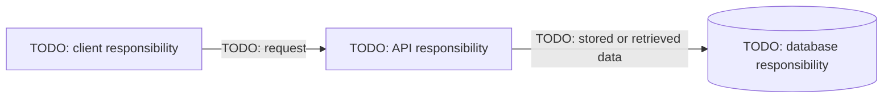

# URL Shortener: My Practice

Status: TODO

Attempt: TODO — independent, with a hint, or guided by the reference

## Prompt

Design a service that creates short links for long URLs and redirects visitors who open them. For the Day 1 session, write three functional requirements, two non-goals, and one measurable latency goal. Draw a client, API service, and database, and explain the two main request flows.

Spend about 25 minutes. Use your own words and make your assumptions visible.

## 1. Explain the problem

Who uses it and why? Show one long URL and the short URL you want the service to return.

TODO

## 2. Functional requirements

A functional requirement describes observable behavior. Include a success example for each requirement.

1. TODO
2. TODO
3. TODO

## 3. Non-goals

A non-goal is a feature you intentionally exclude from this version. Explain why excluding it helps keep the exercise focused.

1. TODO
2. TODO

## 4. Assumptions and latency goal

Write your assumptions about the load, stored links, and link lifetime. They are choices for the exercise, not measured facts.

- Assumptions: TODO
- Operation being measured: TODO
- Measurement starts and ends at: TODO
- Percentile and time limit: TODO
- Load and observation period: TODO
- How I will track failures separately: TODO

Does your measurement include loading the destination website? Explain your choice.

TODO

## 5. Data to remember

Choose the fields needed for one stored link. Identify which field must be unique and explain what happens if two requests try to store the same identifier.

| Field | Example | Why it is needed |
| --- | --- | --- |
| TODO | TODO | TODO |
| TODO | TODO | TODO |
| TODO | TODO | TODO |

What should survive an API server restart?

TODO

## 6. Architecture diagram

Replace the labels below and add labeled arrows for returned information. GitHub renders this Mermaid block.

## 7. Trace the requests

### Creating a link

Write the request, validation, storage operation, and response in order. State when it is safe to return success.

TODO

### Opening a link

Write the request, lookup, response, and the browser's next action. Identify which component contacts the destination website.

TODO

## 8. Failure cases

| Situation | Response or behavior | Why |
| --- | --- | --- |
| Invalid destination URL | TODO | TODO |
| Unknown short code | TODO | TODO |
| Duplicate generated code | TODO | TODO |
| Database unavailable | TODO | TODO |
| Destination website unavailable | TODO | TODO |

## 9. Trade-off and open question

- My choice: TODO
- Benefit: TODO
- Cost or limitation: TODO
- Evidence that would make me change the choice: TODO
- One question I would ask the interviewer: TODO

## 10. Explain it aloud

Write a 60–90 second explanation connecting your requirements, data, request flows, and one failure case.

TODO

## Review my reasoning

- [ ] I wrote three functional requirements and two non-goals.
- [ ] My latency goal names an operation, boundary, load, and time limit.
- [ ] My diagram agrees with my stored fields and request flows.
- [ ] I explained when a created link becomes usable.
- [ ] I distinguished an unknown code from a failed lookup.
- [ ] I explained one trade-off and recorded what help I used.

These checkboxes record practice; they do not certify interview readiness.

## What I learned

- What I can now explain without notes: TODO
- What I still need to practice: TODO

Compare with the [reference design](reference.md) and [step-by-step guide](../../Explanation/url-shortener.md) after your attempt.
