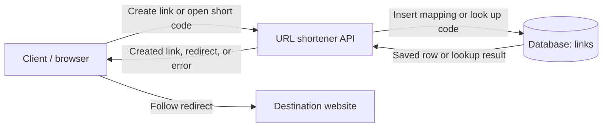

# URL Shortener: Reference Design

This is one reasonable answer to the Day 1 exercise. The numbers and product policies below are explicit exercise assumptions. This is a proposed design; no service or benchmark is implemented here.

## Scope

A user submits a long URL and receives a short link. A visitor opening that short link reaches the original destination.

### Three functional requirements

1. **Create:** Accept a valid absolute HTTP(S) destination URL, save its mapping, and return a short link after storage succeeds.
2. **Redirect:** Opening a known short link returns a redirect to its stored destination, including its query string and fragment.
3. **Explain failures:** Reject invalid input and report an unknown code clearly. A storage failure is reported as a service failure rather than an unknown link.

### Two non-goals

1. User accounts and ownership management.
2. Click analytics and reporting.

### Assumptions

- One deployment region and a modest initial workload.
- Links have no expiration or destination edits in this version.
- Repeated submissions of the same destination may create different short links.
- The API accepts absolute `http` or `https` URLs with a host, up to a chosen 2,048 UTF-8 bytes, and rejects embedded credentials, control characters, and its own shortener host. The byte limit is a service policy, not a universal URL limit.
- The API stores the destination; the browser contacts that destination after the redirect.

### One measurable latency goal

**p95 successful redirect processing time ≤ 100 ms**, measured from the API receiving the request to finishing its redirect response. Assess it during a 10-minute test at 100 valid-link redirect requests/second with 100,000 mappings already stored. Track timeouts and failed requests separately so fast successes cannot hide failures. Destination website loading and the user's network are outside this boundary.

This is a target to test if the service is built, not an achieved result.

## Components and data

| Field | Example | Purpose |
| --- | --- | --- |
| `short_code` | `aB3x9Q2r` | Unique, case-sensitive primary key used by the short link. |
| `destination_url` | `https://shop.example.com/products/42?campaign=fall#details` | Complete destination to return in the redirect. |
| `created_at` | `2026-09-29T18:00:00Z` | Records when the mapping was created. |

Use a persistent relational database, for example PostgreSQL, so mappings survive API restarts. The primary key enforces uniqueness; it also supports indexed lookup. See [PostgreSQL primary keys](https://www.postgresql.org/docs/current/ddl-constraints.html#DDL-CONSTRAINTS-PRIMARY-KEYS).

## Request flows

**Create:** `POST /links` with `{"url":"https://shop.example.com/products/42?campaign=fall#details"}` → validate the input → generate an eight-character random code → insert the row → after the database commits, return `201 Created` with the short URL. Return its address in the `Location` header too. On a code collision, generate another candidate, with at most three insert attempts. Storage errors or exhausted attempts return `503 Service Unavailable`.

**Open:** `GET /s/aB3x9Q2r` → retrieve the row by its exact code → return `302 Found`, `Location: <destination_url>`, and `Cache-Control: no-store` → the browser requests the destination. An unknown code returns `404 Not Found`; an unavailable database returns `503`.

The meaning of `201` is specified in [HTTP Semantics](https://www.rfc-editor.org/rfc/rfc9110.html#name-201-created). A browser follows a `302` using the [`Location` header](https://developer.mozilla.org/en-US/docs/Web/HTTP/Reference/Status/302). [`no-store`](https://developer.mozilla.org/en-US/docs/Web/HTTP/Reference/Headers/Cache-Control#no-store) tells caches not to store the response.

## Trade-off

Looking up the database for each visit and returning `302` with `no-store` keeps redirect behavior easy to reason about and leaves room for future policy changes. It adds a service request and database read per visit. The API and database are availability dependencies, and this first diagram does not establish resilience to their failures. Revisit the design if measurements show the database is a bottleneck or requirements demand higher availability.

## Failure trace

- Invalid URL: return `400 Bad Request` before generating or storing a code.
- Unknown code: a successful database lookup finds no row; return `404`.
- Code collision: the database rejects a duplicate code; retry another candidate without overwriting the original row.
- Database unavailable: return `503`, because the service cannot know whether the link exists.
- Destination unavailable: the shortener can still return the correct redirect; the subsequent browser request fails at the destination.
- Create response lost after commit: the stored link may exist even though the client did not receive it. A repeated create can produce another link under this version's policy.

## Interview explanation

“I will support creating a short link, redirecting a known code, and clear input or lookup failures. Accounts and analytics are outside the first version. I store a unique code and its destination in a persistent database. Creation returns success after the mapping commits. Opening a link looks up the code and returns a redirect for the browser to follow. An unknown code is a 404, while a failed database lookup is a 503. My assumed goal is p95 redirect processing within 100 ms at a stated test load. The simple design costs a database lookup per visit; I would use measurements and availability requirements to guide the next change.”

Read the [tutorial](../../Explanation/url-shortener.md) for the reasoning, worked messages, and follow-up questions. Try your own [practice worksheet](practice.md).
